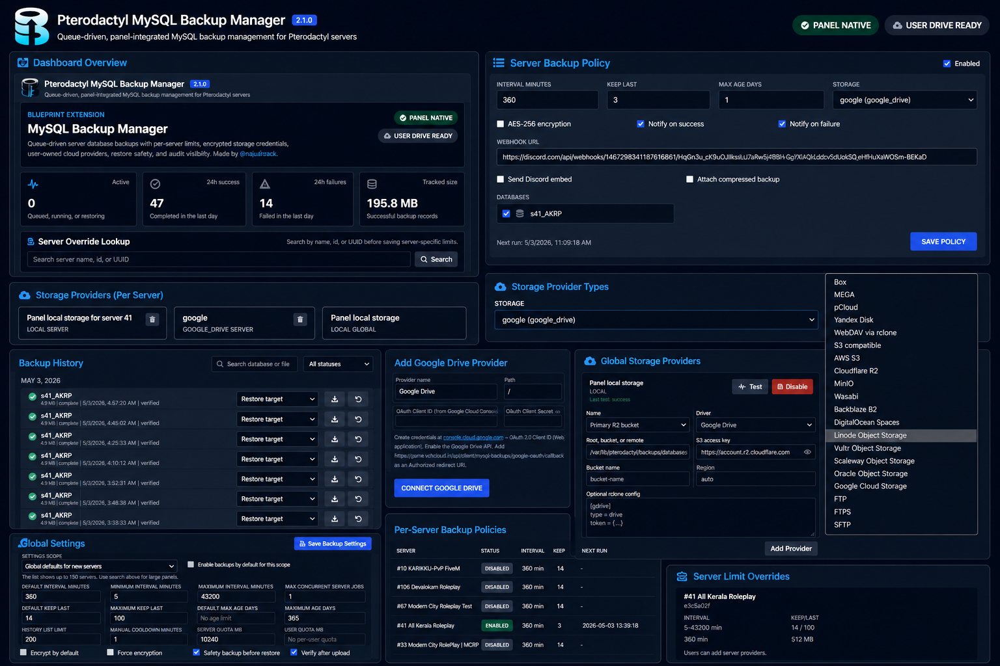

# Pterodactyl MySQL Backup Manager

Queue-driven, panel-native MySQL backups for Pterodactyl, packaged as a Blueprint extension.

Made by [@najuaircrack](https://github.com/najuaircrack).



<p align="center">
  <sub>
    ! This is an AI generated showcase image intended to visually represent all features in one view. 
    The actual interface may differ slightly.
  </sub>
</p>

## What It Does

- Runs MySQL backups through Laravel queues, not external cron scripts.
- Creates one queued backup record per database before the worker starts, so manual and scheduled backups are visible immediately.
- Supports per-server backup policies, intervals in minutes, retention limits, storage quotas, restore safety backups, and manual cooldowns.
- Streams `mysqldump` output directly into compressed `.sql.gz` files.
- Optionally encrypts backups using AES-256-GCM, producing `.sql.gz.enc`.
- Imports and lists legacy local backups from existing backup folders.
- Lets users download, restore, delete, filter, search, and monitor backup progress from the server panel.
- Gives admins global defaults, server-specific limits, provider health checks, audit logs, and backup history.
- Enforces storage quotas at three levels: pre-queue, post-dump (before upload), and post-upload (automatic pruning of oldest backups).
- Supports local, S3-compatible, FTP, FTPS, SFTP, Google Drive, Dropbox, OneDrive (one-click OAuth), WebDAV (native), and Box, MEGA, pCloud, Yandex Disk, generic rclone (advanced).

## Storage Provider Tiers

| Tier | Providers | User experience |
|------|-----------|-----------------|
| One-click OAuth | Google Drive, Dropbox, OneDrive | Click "Connect" → authorise → done. No client ID or secret needed. |
| Native (no deps) | WebDAV | Enter URL + username + password. |
| Key-based | S3, AWS S3, Cloudflare R2, Backblaze B2, Wasabi, MinIO, DigitalOcean Spaces, Linode, Vultr, Scaleway, Oracle, Google Cloud Storage | Paste access key/secret + bucket + endpoint. |
| Server credentials | FTP, FTPS, SFTP | Enter host, username, password, port, root path. |
| Advanced (rclone) | Box, MEGA, pCloud, Yandex Disk, generic rclone | Requires the rclone binary on the panel host + an encrypted rclone config block. |

## Architecture

The extension is fully panel integrated:

- `MysqlBackupSchedulerService` reconciles due schedules from the database.
- `MysqlBackupQueueService` creates backup records and dispatches database jobs.
- `ProcessMysqlDatabaseBackupJob` runs `mysqldump`, compresses, encrypts when enabled, enforces quota, uploads, verifies, notifies, and enforces retention.
- `MysqlBackupStorageManager` abstracts local, S3-style, FTP/SFTP, native WebDAV, rclone, and one-click OAuth (Google Drive, Dropbox, OneDrive) storage.
- `GoogleDriveOAuthService`, `DropboxOAuthService`, `OneDriveOAuthService` handle OAuth token exchange, refresh, and direct API uploads — no rclone required for these providers.
- `MysqlBackupRetentionService` enforces retention-by-count, retention-by-days, and quota-based pruning of oldest backups.
- `MysqlBackupQuotaService` tracks per-server and per-user storage usage and enforces quotas.
- `MysqlBackupAdminSettingsService` manages global and per-server admin defaults, including admin-owned OAuth app credentials.
- React server UI handles policy, provider setup, manual backup, restore, download, delete, progress, and history.
- Blade admin UI handles operational controls, OAuth app configuration, provider testing, server limit overrides, and audits.

## Requirements

- Pterodactyl panel with [Blueprint](https://github.com/TeamBluePrint/Blueprint) installed, target `beta-2026-01`.
- Working Laravel queue worker, normally `pteroq`.
- `mysqldump` and `mysql` available on the panel host.
- Optional: `rclone` for Box, MEGA, pCloud, Yandex Disk, and generic rclone remotes. **Not required for Google Drive, Dropbox, OneDrive, or WebDAV.**
- Optional: Flysystem FTP/SFTP adapters, installed by `private/install.sh`.

## Installation

### For End Users

Download the latest `mysqlautobackup.blueprint` from the [GitHub releases page](https://github.com/najuaircrack/pterodactyl-mysql-backup/releases), then install it on your panel:

```bash
cd /var/www/pterodactyl

# Download the latest release (or upload the .blueprint file manually)
wget https://github.com/najuaircrack/pterodactyl-mysql-backup/releases/latest/download/mysqlautobackup.blueprint

# Install the extension
blueprint -i mysqlautobackup

# Restart the queue worker
systemctl restart pteroq
```

If you use FTP, FTPS, or SFTP storage, install the Flysystem adapters after the extension is installed:

```bash
cd /var/www/pterodactyl
composer require league/flysystem-ftp league/flysystem-sftp-v3
systemctl restart pteroq
```

### For Development

Clone the repo into your Blueprint development directory and build from source:

```bash
cd /var/www/pterodactyl/blueprint/dev
git clone https://github.com/najuaircrack/pterodactyl-mysql-backup.git mysqlautobackup

# If Blueprint developer mode is not enabled, enable it:
export is_developer=0

# Build the extension
cd /var/www/pterodactyl
blueprint -build
php artisan migrate --force
php artisan optimize:clear
php artisan queue:restart
systemctl restart pteroq
```

After making changes, re-run `blueprint -build` and `php artisan optimize:clear` to apply them.

---

## Setting Up One-Click Cloud Storage (Google Drive, Dropbox, OneDrive)

The admin registers **one OAuth app per provider** in the admin settings. Users then click a single "Connect" button — they never see a client ID or secret. Backups upload to each user's own cloud account.

### How It Works

1. **Admin** creates an OAuth app at the provider's developer console (Google Cloud, Dropbox, Azure).
2. **Admin** enters the app's client ID and secret in **Admin → MySQL Auto Backup → One-Click Cloud Apps**.
3. **Users** open their server's MySQL Backups tab, click **Add Provider**, select the provider, and click **Connect {Provider}**.
4. A consent popup opens; the user authorises the app and the popup closes automatically.
5. Backups upload to the user's own cloud storage — no server-side rclone or per-user OAuth apps.

### Redirect URI

Every OAuth app must whitelist this exact redirect URI (shown in the admin panel):

```
https://your-panel-domain/api/client/extensions/mysqlautobackup/mysql-backups/oauth/callback
```

> Replace `your-panel-domain` with your actual panel domain. No trailing slash. Use `https`, not `http`.

### Google Drive Setup

1. Go to [Google Cloud Console](https://console.cloud.google.com) → create or select a project.
2. Enable the **Google Drive API** (APIs & Services → Library).
3. Configure the **OAuth consent screen** (External). Add your email as a test user, or click **Publish App** to allow any Google account.
4. Go to **Credentials → + Create Credentials → OAuth 2.0 Client ID** (Web application).
5. Add the redirect URI above under **Authorized redirect URIs**.
6. Copy the **Client ID** and **Client Secret** into the admin panel's Google Drive section.

> Google shows an "unverified app" warning until you verify the app or publish it. Unverified apps are capped at 100 users.

### Dropbox Setup

1. Go to [Dropbox App Console](https://www.dropbox.com/developers/apps) → **Create app**.
2. Choose **Scoped access** → **Full Dropbox** (or app folder if you prefer).
3. Under **Permissions**, grant: `files.content.write`, `files.content.read`, `files.metadata.write`.
4. Under **Settings**, add the redirect URI above to **Redirect URIs**.
5. Copy the **App key** (client ID) and **App secret** into the admin panel's Dropbox section.

### OneDrive Setup

1. Go to [Azure Portal → App Registrations](https://portal.azure.com/#blade/Microsoft_AAD_RegisteredApps/ApplicationsListBlade) → **New registration**.
2. Under **Authentication**, add the redirect URI above as a **Web** platform redirect URI.
3. Under **API Permissions**, add **Microsoft Graph → Delegated**: `Files.ReadWrite`, `offline_access`.
4. Under **Certificates & secrets**, create a **New client secret** and copy the value.
5. Copy the **Application (client) ID** and the **Client Secret** into the admin panel's OneDrive section.
6. Set **Tenant** to `common` (allows any Microsoft account) or your org's tenant ID to restrict to your org.

### Connecting as a User

1. Open a server in the panel → **MySQL Backups** tab.
2. Click **Add Provider**, select the provider (Google Drive / Dropbox / OneDrive).
3. Enter a name (e.g. `My Drive`) and click **Connect {Provider}**.
4. Authorise in the popup — it closes automatically.
5. Set the provider as the storage target in the backup configuration.

### Backward Compatibility

Existing Google Drive providers that were configured with per-user client ID/secret continue to work. The service falls back to the stored per-provider credentials when admin-level OAuth app credentials are not set. New providers always use the admin-owned app.

### Retention

Retention works automatically. When a backup is pruned by the retention policy, the extension calls the provider's API to delete the file. No manual cleanup needed.

### Troubleshooting One-Click Cloud

**"redirect_uri_mismatch"** — The redirect URI in the provider's console doesn't match exactly. Copy it from the admin panel's One-Click Cloud Apps section.

**"did not return a refresh token"** — Revoke the app's access in your account settings, then connect again. Google: [myaccount.google.com/permissions](https://myaccount.google.com/permissions). Dropbox: [dropbox.com/account/connected_apps](https://www.dropbox.com/account/connected_apps).

**"admin has not configured this provider"** — The admin hasn't entered the OAuth app credentials yet, or the provider is not in the allowed drivers list.

**Popup is blocked** — Allow popups for your panel domain, then click Connect again.

---

## WebDAV Storage

WebDAV is built in natively — no rclone or extra packages required.

1. Admin enables the WebDAV driver in **Admin → MySQL Auto Backup → Build Storage Defaults**.
2. User clicks **Add Provider**, selects **WebDAV**, and enters:
   - **WebDAV URL** — the base URL, e.g. `https://dav.example.com/backups`
   - **Username** and **Password**
3. The extension handles directory creation (MKCOL), upload (PUT), download (GET), and delete (DELETE) via curl.

---

## Storage Quotas

Quotas are enforced at three levels to prevent any single backup or cumulative usage from exceeding the configured limits:

### 1. Pre-queue check

Before a backup is queued, the extension checks if the server or user has already reached its quota. If so, the backup is rejected immediately with a clear error message.

### 2. Post-dump check (before upload)

After `mysqldump` completes and the compressed file is measured, the extension checks if the backup's own size exceeds the quota. If a single backup is larger than the entire quota, it is rejected before upload — no wasted bandwidth. The error message shows both the backup size and the quota, e.g.:

> This backup is 6.2 GB which exceeds the server quota of 5 GB. The backup was cancelled before upload.

### 3. Post-upload pruning

After a successful upload, if the cumulative usage exceeds the quota, the oldest backups are automatically pruned (file deleted from storage + record removed) until usage drops back under the limit.

### Configuring Quotas

In **Admin → MySQL Auto Backup → Backup Policy**:

- **Server quota (MB)** — per-server storage limit. Set to 0 to disable.
- **User quota (MB)** — per-user storage limit across all their servers. Leave blank to disable.

Both server and user quotas are enforced independently. A backup must fit within both limits.

---

## Managing Backups

### Download

Click the download icon on any successful or restored backup to download the `.sql.gz` or `.sql.gz.enc` file.

### Restore

1. Select a target database from the dropdown on the backup row.
2. Click the restore icon.
3. Confirm the overwrite warning.
4. The restore is queued and runs through the Laravel queue worker. A safety backup of the target database is created first (unless disabled by the admin).

### Delete

1. Click the trash icon on any successful, failed, or restored backup.
2. Click **Confirm?** to confirm.
3. The backup file is deleted from storage and the record is removed.

> Running or restoring backups cannot be deleted until they complete.

### Manual Backup

Click **Manual Backup** to queue an immediate backup of all selected databases. Manual backups are subject to a configurable cooldown to prevent abuse.

---

## Environment

```env
MYSQL_BACKUP_LOCAL_ROOT=/var/lib/pterodactyl/backups/databases
MYSQL_BACKUP_MYSQLDUMP_PATH=mysqldump
MYSQL_BACKUP_MYSQL_PATH=mysql
MYSQL_BACKUP_RCLONE_PATH=rclone
MYSQL_BACKUP_ENCRYPTION_KEY=
MYSQL_BACKUP_DUMP_USERNAME=
MYSQL_BACKUP_DUMP_PASSWORD=
MYSQL_BACKUP_DUMP_HOST=
MYSQL_BACKUP_DUMP_IDLE_TIMEOUT=300
MYSQL_BACKUP_DISCORD_MAX_ATTACHMENT_BYTES=26214400
MYSQL_BACKUP_ALLOW_PRIVATE_URLS=false
```

Generate a strong encryption key:

```bash
php -r "echo bin2hex(random_bytes(32));"
# Add to .env as: MYSQL_BACKUP_ENCRYPTION_KEY=<output>
```

Most runtime limits are configured in the admin panel. Environment values are used for binary paths, optional defaults, and security overrides.

---

## Advanced Storage via rclone (Box, MEGA, pCloud, Yandex Disk)

For providers that don't have a native one-click integration, users supply an rclone config block:

1. Admin enables `Allow users to add server storage providers` and the desired provider (Box, MEGA, pCloud, Yandex Disk, or generic rclone).
2. User creates a remote with rclone on a trusted machine:

```bash
rclone config
rclone config show myremote
```

3. User adds the provider in the panel, sets a remote path like `myremote:pterodactyl/mysql-backups`, and pastes the rclone config block.

> Google Drive, Dropbox, OneDrive, and WebDAV do **not** need rclone — they have native integrations. This section is only for Box, MEGA, pCloud, Yandex Disk, and generic rclone remotes.

The config is stored encrypted in the database and written to a temporary `0600` file only while a job runs.

---

## MySQL Permissions

If Pterodactyl database users cannot connect from the panel host, configure a dedicated dump user:

```sql
CREATE USER 'ptero_backup'@'PANEL_HOST_OR_IP' IDENTIFIED BY 'strong-password';
GRANT SELECT, SHOW VIEW, TRIGGER, EVENT ON `database_name`.* TO 'ptero_backup'@'PANEL_HOST_OR_IP';
FLUSH PRIVILEGES;
```

Set the credential mode to **Dedicated backup user** in the admin settings and enter the username/password there.

---

## Security Notes

- Database passwords and storage provider credentials are never sent to the frontend.
- Storage provider configs including OAuth tokens are encrypted with Laravel `Crypt`.
- Google Drive / Dropbox / OneDrive OAuth tokens are auto-refreshed server-side. The admin-owned client secret is encrypted and never sent to the frontend.
- OAuth app credentials are global — they cannot be overridden per-server.
- OAuth state is validated against the session CSRF token on callback.
- Optional backup encryption uses AES-256-GCM. Set `MYSQL_BACKUP_ENCRYPTION_KEY` to a dedicated random value (32+ chars) — without it, encryption falls back to the app key, which means compromising the app key also compromises encrypted backups.
- Webhook and WebDAV URLs are blocked if they resolve to private, reserved, or link-local IP ranges unless `MYSQL_BACKUP_ALLOW_PRIVATE_URLS=true`.
- Rclone remotes must use named remotes like `gdrive:path`; inline remotes and parent traversal are rejected.
- The rclone `local` type is blocked entirely — it would allow file access on the panel host.
- Generic rclone is disabled by default for new installs.
- Restore jobs verify that the target database belongs to the same server as the backup record.
- Database passwords are never passed through `unserialize()` — serialized string passwords are safely parsed without invoking PHP object deserialization.

---

## Operations

After changing code or rebuilding:

```bash
php artisan optimize:clear
php artisan queue:restart
systemctl restart pteroq
```

Useful checks:

```bash
systemctl status pteroq
php artisan queue:failed
php artisan queue:retry all
```

---

## Troubleshooting

**`mysqldump: Got error: 1045 Access denied`**

Use a dedicated backup user and ensure the MySQL host allows that user from the panel host IP.

**Manual backups are queued but never complete**

Check `pteroq`, failed Laravel jobs, and that `mysqldump` is available to the panel user.

**Local provider test fails**

```bash
chown -R www-data:www-data /var/lib/pterodactyl/backups/databases
chmod -R 750 /var/lib/pterodactyl/backups/databases
```

**Backup rejected for exceeding quota**

The backup's own size is larger than the configured server or user quota. Either increase the quota in the admin settings, reduce the database size, or clean up old backups to free space.

**Quota not enforced / backups go over the limit**

Quotas are checked at three points: before queueing, after the dump (before upload), and after upload (automatic pruning). If a backup was created before these checks were added, it will still count toward usage. Delete old backups manually or let the post-upload pruner catch up on the next backup.

**rclone upload fails (Box, MEGA, pCloud, Yandex Disk, generic rclone)**

Confirm `rclone` is installed, the remote name in the path matches the pasted config block, and the config block includes the correct `type` section. Google Drive, Dropbox, OneDrive, and WebDAV do not use rclone.

**WebDAV upload fails**

Verify the WebDAV URL is reachable from the panel host, credentials are correct, and the server supports PUT/MKCOL/DELETE methods. Some WebDAV servers require HTTPS — ensure the URL uses `https://`.
